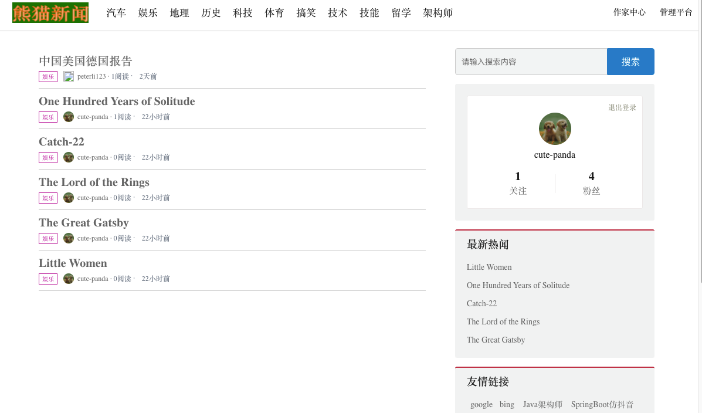
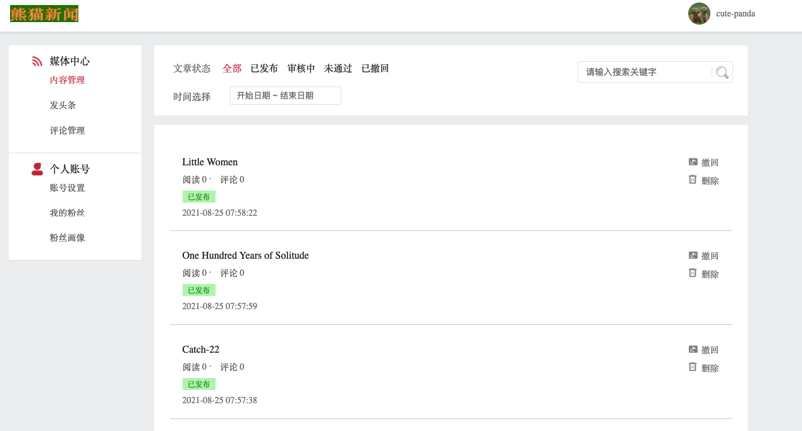
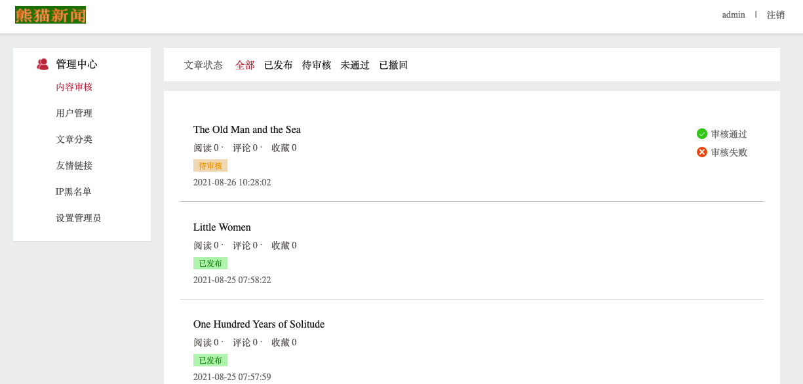
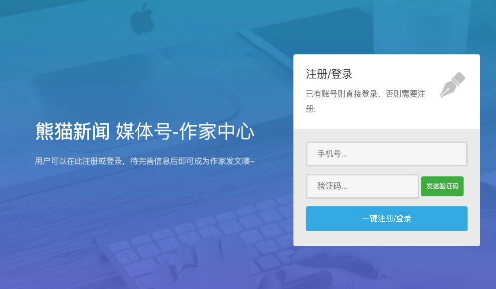
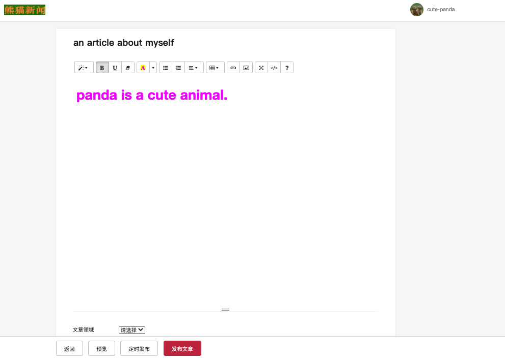
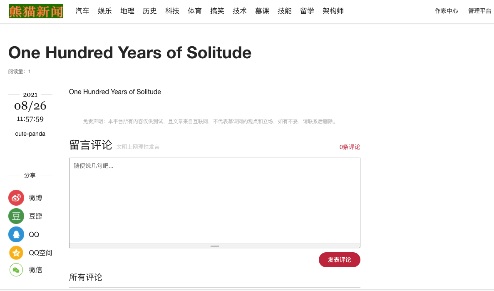
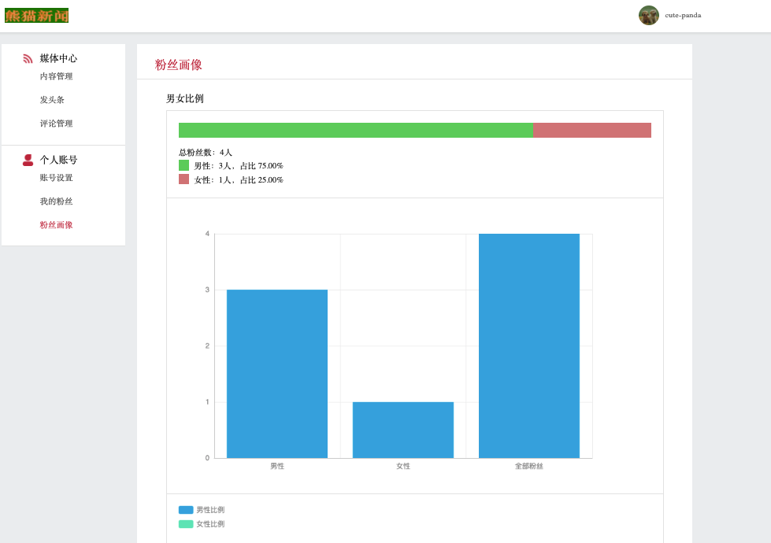

[![Contributors][contributors-shield]][contributors-url]
[![Forks][forks-shield]][forks-url]
[![Stargazers][stars-shield]][stars-url]
[![Issues][issues-shield]][issues-url]
[![MIT License][license-shield]][license-url]


<br/>
<p align="center">
  <h1 align="center">Spring-Cloud-Blog-REST-API</h1>
</p>


<details open="open">
  <summary>Table of Contents</summary>
  <ol>
    <li>
      <a href="#about-the-project">About The Project</a>
      <ul>
        <li><a href="#features">Features</a></li>
        <li><a href="#implementations">Implementations</a></li>
        <li><a href="#built-with">Built With</a></li>
      </ul>
    </li>
    <li><a href="#requirements">Requirements</a></li>
    <li><a href="#how-to-run">How to Run</a></li>
    <li><a href="#usage">Usage</a></li>
    <li><a href="#license">License</a></li>
    <li><a href="#contact">Contact</a></li>
  </ol>
</details>


<br />

## About The Project

<h4>This is a Spring Cloud blog application REST API with tons of ready-to-use features. The idea was to build a blogging platform that can be used as a starter for larger projects. It was made with Maven, Spring Boot, Spring Cloud, FreeMarker, Nginx, Tomcat, MySQL, MongoDB, Redis, RabbitMQ, ElasticSearch, and Alibaba Cloud Content Moderation and Face Detection Service</h4>
<br/>

<br/>
<br/>


## Features
- Posts: crud / category / recommendation
- Comment: crud
- User: register / login/ logout
- Admin: user management / posts review / IP blacklisting / role assignment / partnership links
- Search: searching / highlighting
- Analysis: user portrait
- Fans: follow / unfollow
- Security: face recognition login / content detection / SMS authentication

## Implementations
App Architecture:
- Multi-module Maven app
- Modular Service/Repository components
- Spring / Maven profiles for different environments: dev/prod

MicroService:
- Spring Cloud Eureka: service registry and discovery
- Spring Cloud Ribbon: client-side load balancer
- Spring Cloud Feign: simplified HTTP API clients interface
- Spring Cloud Hystrix: throttling and circuit breaker
- Spring Cloud Config: centralized config server with GitHub config source
- Spring Cloud Sleuth: distributed tracing

Spring MVC:
- MVC with Freemarker templating engine
- Live update of Freemarker templates for local development
- Custom and centralized exception handling
- Request logger filter
- Swagger API Docs with UI (http://localhost:port/swagger-ui.html)
- CRUD UI and file upload

Security:
- Account management with an admin service
- Authentication with SMS
- User authority entity and repository/services
    - login, logout, home pages based on user role
- Centralized authentication filter
- IP based throttling and blacklisting

Persistence/Search:
- MyBatis integration with code generation based on database schemas
- FastDFS with Nginx load balancer
- MySQL for transational operations
- Redis for caching
- MongoDB for key-value store and binary file storage
- Elasticsearch for searching, highlighting, and user portrait analysis

Message broker:
- RabbitMQ for notification and asynchronous operations

Test:
- Integration test with Talend API Tester Chrome extension

<br/>

## Built With

* [Java 8](https://www.oracle.com/java/technologies/java8.html)
* [Maven](https://maven.apache.org/)
* [Spring Boot](https://spring.io/projects/spring-boot)
* [Spring Cloud](https://spring.io/projects/spring-cloud)
* [MySQL](https://www.mysql.com/)
* [MongoDB](https://www.mongodb.com/)
* [Redis](https://redis.io/)
* [RabbitMQ](https://www.rabbitmq.com/)
* [Elasticsearch](https://www.elastic.co/)
* [FastDFS](https://github.com/happyfish100/fastdfs)
* [Nginx](https://www.nginx.com/)
* [FreeMarker](https://freemarker.apache.org/)
* [Alibaba Cloud Content Moderation Service](https://www.alibabacloud.com/product/content-moderation)
* [Alibaba Cloud Face Recognition Service](https://ai.aliyun.com/face)
* [Docker](https://www.docker.com/)
* [Tomcat](https://tomcat.apache.org/)

<br/>

## Requirements
- Java 8
- Git
- IntelliJ IDEA Community
- Tomcat 7+
- Maven 3.6.3
- MySQL 5.7
- Redis 2.8
- Docker 20.10.5

## How to Run 
It contains following middlewares and services:

Middlewares:
* RabbitMQ
* Elasticsearch
* MySQL
* Redis
* FastDFS
* MongoDB
* Nginx

Services:
* admin service
* user service
* article service
* file storage service
* search service
* Spring Cloud eureka service
* Spring Cloud config service
* Spring Cloud zuul service

Middlewares - Run with Docker

RabbitMQ: 
```sh
docker run -d --hostname my-rabbit --name some-rabbit -p 15672:15672 -p 5672:5672 rabbitmq:3-management
```
Elasticsearch:
```sh
docker run -p 9200:9200 -p 9300:9300 -e "discovery.type=single-node" docker.elastic.co/elasticsearch/elasticsearch:7.6.2
```
MySQL:
```sh
docker run --name mysql5.7 -p 3306:3306 -e MYSQL_ROOT_PASSWORD=password -d mysql:5.7
```
Redis:
```sh
docker run --name some-redis -d redis
```
FastDFS:
```sh
docker run -d --name tracker -p 22122:22122 -v /Users/username/develop/temp/tracker:/var/fdfs delron/fastdfs tracker

docker run -d --name storage -p 8888:8888 -p 23000:23000 -e TRACKER_SERVER=10.69.176.22:22122 -v /Users/username/develop/temp/storage:/var/fdfs -e GROUP_NAME=group1 delron/fastdfs storage
```

MongoDB:
```sh
docker run -d --name mongodb-10 -p 27017-27019:27017-27019 -v /Users/username/develop/temp/mongodb.conf:/etc/mongodbconf -v /Users/username/develop/temp/mongodb.log/mongo.log:/tmp/mongodb.log -v /Users/username/develop/temp/mongodb.data:/data/db mongo:4.2.8 -f /etc/mongodbconf/mongod-container.conf
```

Nginx:
```sh
docker run --name mynginx1 -p 80:80 -d nginx
```

Micro-services - Run with IntelliJ IDE
 - Clone the Git repositore:
    ```sh
    https://github.com/cutePanda123/news-backend.git
    ```
 - Import the project into IntelliJ IDE
 - Install and build:
    ```sh
    mvn clean install
    ```
- Run each services from IDE (order matters):
    * Spring Cloud eureka service
    * Spring Cloud config service
    * Spring Cloud zuul service
    * admin service
    * user service
    * article service
    * file storage service
    * search service

* Tools for testing and debugging:
  * [IntelliJ IDE Debugger](https://www.jetbrains.com/help/idea/debugging-code.html)
  * [MySQL Workbench](https://www.mysql.com/products/workbench/)
  * [RDM](https://rdm.dev/)
  * [Talend API Tester](https://chrome.google.com/webstore/detail/talend-api-tester-free-ed/aejoelaoggembcahagimdiliamlcdmfm?hl=en)
  * [Postman](https://www.postman.com/)
  * [ElasticSearch Head](https://chrome.google.com/webstore/detail/elasticsearch-head/ffmkiejjmecolpfloofpjologoblkegm?hl=en-US)
<br />

## Usage

* Home page
  <br/>
  <br/>
  
  <br/>
  <br/>
* User page
  <br/>
  <br/>
  
  <br/>
  <br/>
* Admin page
  <br/>
  <br/>
  
  <br/>
  <br/>
* User login page
  <br/>
  <br/>
  
  <br/>
  <br/>
* Admin login page
  <br/>
  <br/>
  
  <br/>
  <br/>
* Create a blog
  <br/>
  <br/>
  
  <br/>
  <br/>
* Read and comment a blog
  <br/>
  <br/>
  
  <br/>
  <br/>
* Fans analysis page
  <br/>
  <br/>
  
  <br/>
  <br/>

## License

Distributed under the MIT License. See `LICENSE` for more information.

<br/>

## Contact
Project Link: [https://github.com/cutePanda123/news-backend](https://github.com/cutePanda123/news-backend)


<!-- MARKDOWN LINKS & IMAGES -->
<!-- https://www.markdownguide.org/basic-syntax/#reference-style-links -->
[contributors-shield]: https://img.shields.io/github/contributors/cutePanda123/news-backend.svg?style=for-the-badge
[contributors-url]: https://github.com/cutePanda123/news-backend/graphs/contributors
[forks-shield]: https://img.shields.io/github/forks/cutePanda123/news-backend.svg?style=for-the-badge
[forks-url]: https://github.com/cutePanda123/news-backend/network/members
[stars-shield]: https://img.shields.io/github/stars/cutePanda123/news-backend.svg?style=for-the-badge
[stars-url]: https://github.com/cutePanda123/news-backend/stargazers
[issues-shield]: https://img.shields.io/github/issues/cutePanda123/news-backend.svg?style=for-the-badge
[issues-url]: https://github.com/cutePanda123/news-backend/issues
[license-shield]: https://img.shields.io/github/license/cutePanda123/news-backend.svg?style=for-the-badge
[license-url]: https://github.com/cutePanda123/news-backend/blob/master/LICENSE.txt
